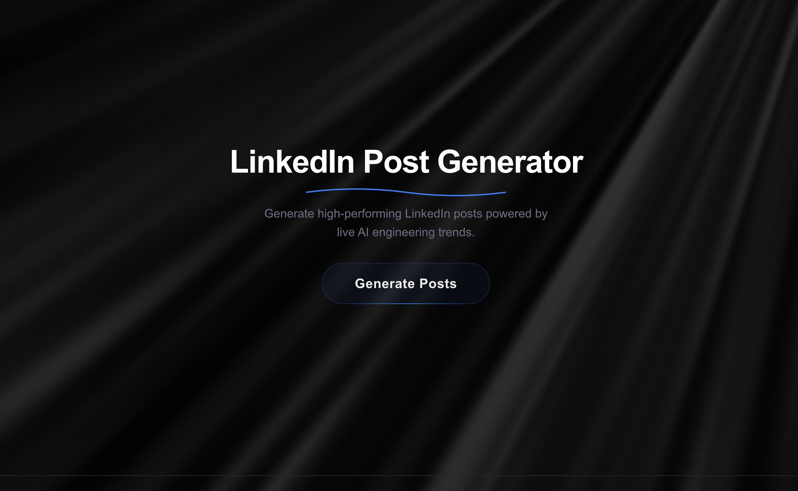
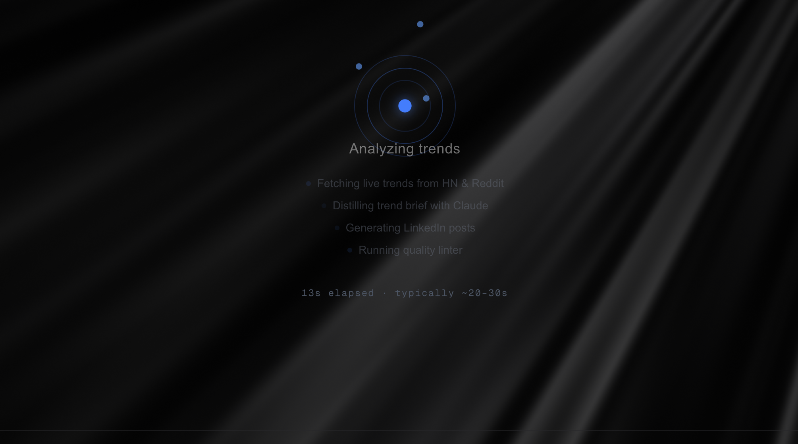
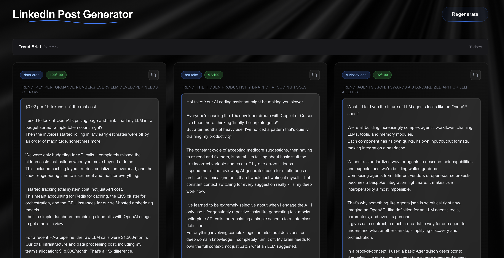

# LinkedIn Post Generator ⚡

A full-stack AI-powered web app that generates high-quality LinkedIn posts for the **AI Engineering** niche — informed by live trending topics and a research-backed style system.

🔗 **Live Demo:** [linkedin-post-gen.vercel.app](https://linkedin-post-gen.vercel.app)

---

<!-- SCREENSHOT CAROUSEL -->
<div align="center">

| | |
|:---:|:---:|
|  |  |
| **Landing Page** | **AI Generation Pipeline** |
|  width="400" alt="Post Detail"/> |
| **Generated Posts** | **Post Detail with Lint Score** |

</div>
---

## What It Does

One button. Five LinkedIn posts. Backed by real-time data.

The app pulls **live trending topics** from Hacker News and Reddit, distills them through Claude into focused editorial angles, then generates polished LinkedIn posts following a **corpus-driven style system** — not generic AI slop.

Every generated post runs through a custom **quality linter** that catches cliché phrases, structural issues, and engagement anti-patterns before you ever see it.

---

## The Style System

Posts aren't generated from vibes. The style system is built on a **three-phase research methodology**:

**Phase 1 — Corpus Collection:** 20-30 high-performing LinkedIn posts from the AI/dev niche, manually curated and tagged with metadata (hook type, structural devices, engagement patterns).

**Phase 2 — Pattern Extraction:** Systematic analysis using NotebookLM across 7 categories — hook taxonomy, structural patterns, tone/voice, credibility moves, closing patterns, engagement triggers, and anti-patterns. Key findings:
- Pain-point hooks appear in 65% of top performers
- First-person "I" voice in 65% of top vs 30% of bottom posts
- White space increases readability by 68%
- External links decrease reach by ~30%

**Phase 3 — Style Guide Encoding:** Findings are distilled into `EXTRACTED_STYLE_GUIDE` — a prompt-ready document that Claude reads at generation time. The LLM never sees raw posts, only the extracted rules.

---

## Quality Linter

Every post passes through `lintPost()` before reaching the UI. It checks for:

| Check | Severity | Penalty |
|:------|:---------|:--------|
| Slop phrases ("game-changer", "excited to share"...) | Error | -8 each |
| Post too short (< 80 chars) | Error | -25 |
| Post too long (> 2000 chars) | Warning | -10 |
| Emoji overuse (> 2) | Warning | -3 each |
| Hashtag spam (> 3) | Warning | -5 |
| Weak hook opening | Warning | -10 |
| External links in body | Warning | -10 |
| ALL CAPS words | Warning | -3 each |
| Corporate "we" voice | Warning | -8 |

Posts scoring **≥ 70** pass. The score is displayed on each card with color coding.

---

## Tech Stack

| Layer | Technology |
|:------|:-----------|
| Framework | Next.js 14 (App Router, TypeScript) |
| Styling | Tailwind CSS |
| LLM | Claude Sonnet via `@anthropic-ai/sdk` |
| LLM | Gemini 2.5-flash via `@google/generative-ai` |
| Trend Sources | Hacker News Algolia API, Reddit JSON API |
| Animations | Framer Motion, @paper-design/shaders-react |
| Deployment | Vercel (Serverless) |
| Analytics | Vercel Analytics |

---

## Project Structure

```
linkedin-post-gen/
├── app/
│   ├── page.tsx                  # Main UI — hero, loading, results states
│   ├── layout.tsx                # Root layout + analytics
│   ├── icon.svg                  # Custom favicon
│   └── api/
│       ├── generate/route.ts     # Orchestrator — full pipeline
│       └── trends/route.ts       # Trend fetching endpoint
├── lib/
│   ├── claude.ts                 # Anthropic SDK wrapper
│   ├── trends.ts                 # HN + Reddit ingestion
│   ├── styleCorpus.ts            # Style guide + curated examples
│   ├── prompts.ts                # All Claude prompts (centralized)
│   └── linter.ts                 # Post quality checker
├── components/
│   ├── PostCard.tsx              # Glassmorphic post display card
│   ├── TrendBrief.tsx            # Collapsible trend brief section
│   ├── LoadingAnimation.tsx      # AI orbital loading animation
│   ├── ErrorDisplay.tsx          # Professional error handling
│   ├── ShaderBG.tsx              # Animated GodRays background
│   └── ui/
│       ├── neon-button.tsx       # Glow button component
│       ├── animated-underline-text-one.tsx  # Animated title
│       └── card.tsx              # Base card component
└── vercel.json                   # API route timeout config
```

---

## Key Design Decisions

**Why two separate Claude calls?** Separating trend distillation from post generation lets each prompt do one job well. The trend brief acts as an editorial filter — Claude picks the 5-8 most "post-worthy" items from 15+ raw trends before writing anything.

**Why a style corpus instead of "write good posts"?** Corpus-driven generation produces measurably better output. The style guide encodes specific, data-backed rules (hook frequencies, structural beats, anti-patterns) rather than vague instructions.

**Why a linter?** LLMs can slip into cliché patterns. The linter catches slop at the output layer, giving a quantitative quality score. It also makes the system **auditable** — you can see exactly why a post scored 84 vs 97.

**Why no user configuration?** The topic is intentionally locked to AI Engineering. Tight scoping means better prompts, better style matching, and better output quality.

---

## Getting Started

### Prerequisites
- Node.js 18+
- Anthropic API key ([get one here](https://console.anthropic.com/))
or Gemini 2.5-flash API key ([get one here](https://cloud.google.com/generative-ai-console))

### Setup

```bash
git clone https://github.com/YOUR_USERNAME/linkedin-post-gen.git
cd linkedin-post-gen
npm install
```

Create `.env.local`:
```
ANTHROPIC_API_KEY=your-key-here
GEMINI_API_KEY=your-key-here
keep any of ANTHROPIC_API_KEY blank if you want to use Gemini or keep GEMINI_API_KEY blank if you want to use Anthropic
```

Run locally:
```bash
npm run dev
```

Open [http://localhost:3000](http://localhost:3000)

## Prompt Engineering

All prompts live in [`lib/prompts.ts`](./lib/prompts.ts) — the most important file in the project.

The prompt architecture follows a clear separation:
- **SYSTEM_PROMPT** — Shared role and output constraints
- **TREND_BRIEF_PROMPT** — Filters raw trends into editorial angles
- **POST_GENERATION_PROMPT** — Generates posts using style guide + few-shot examples

Each prompt is documented with inline comments explaining the engineering decisions.

---

<div align="center">

**Built by [Vatsalya Dabhi](https://github.com/vatsalya2003)**

</div>
